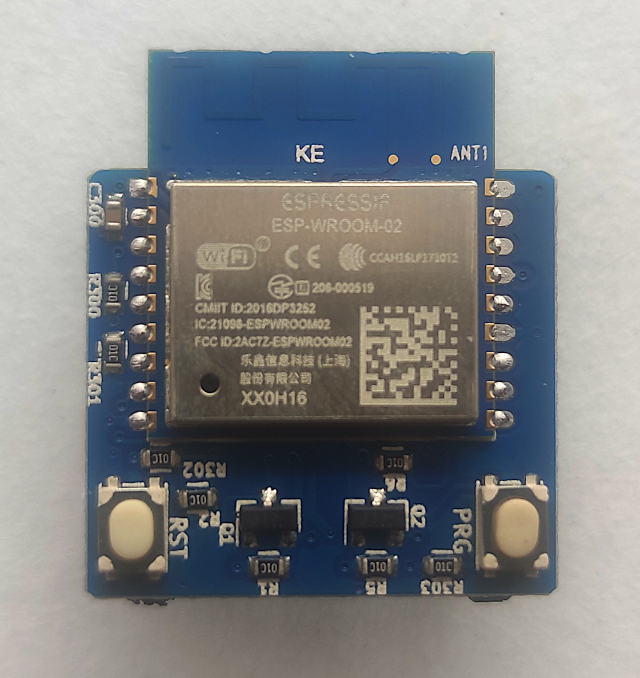
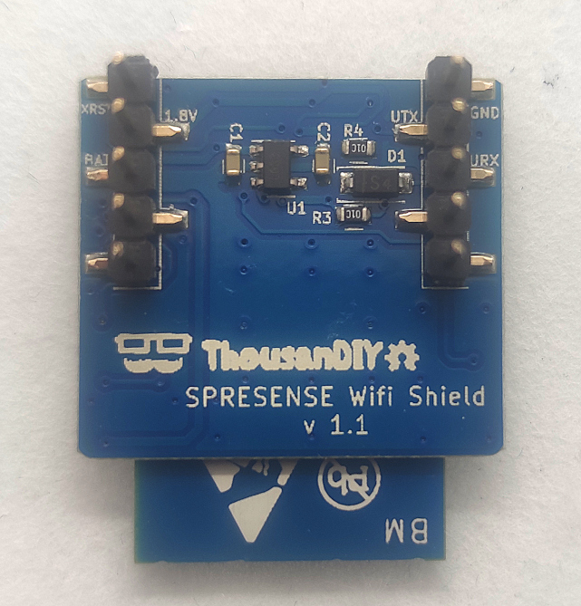
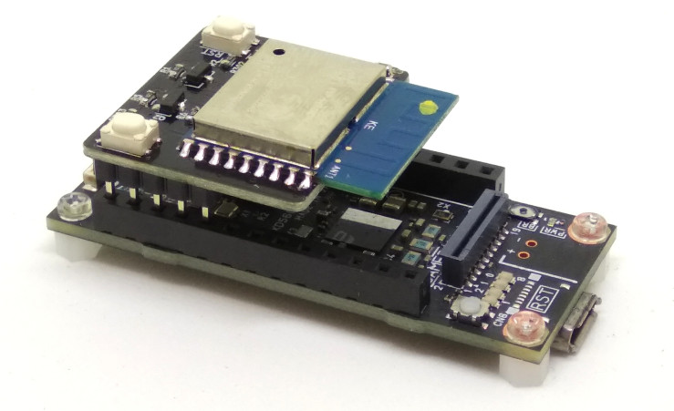
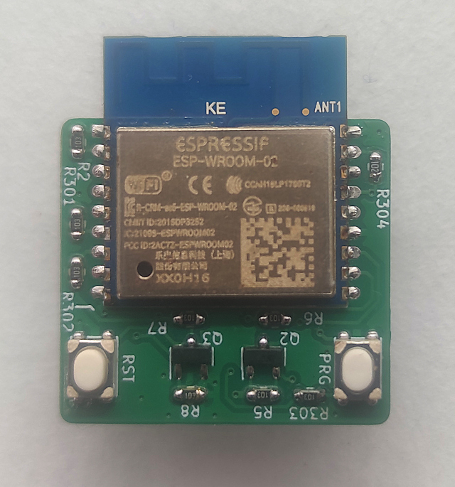
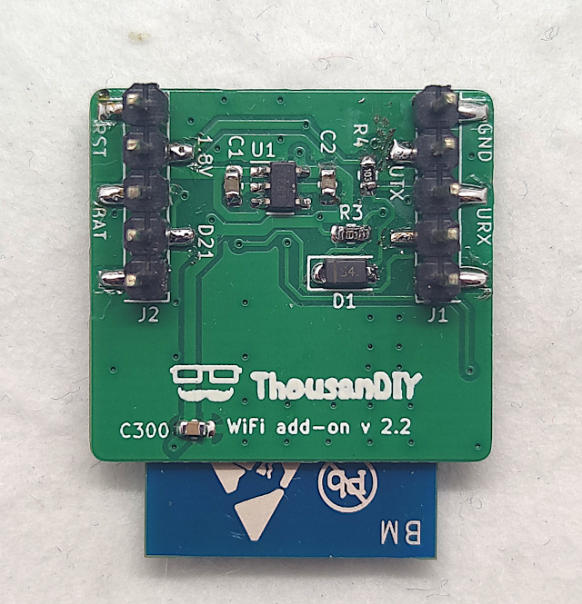
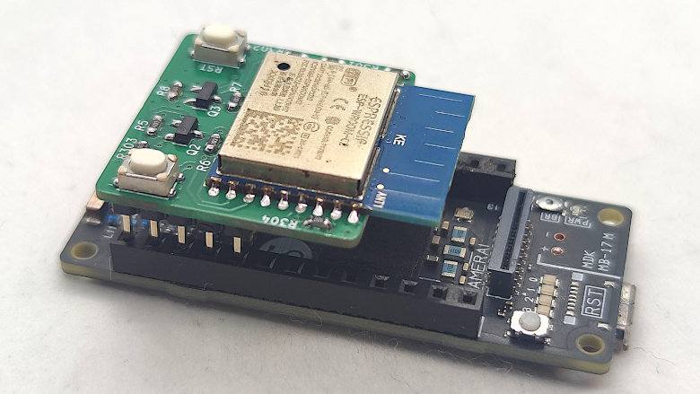
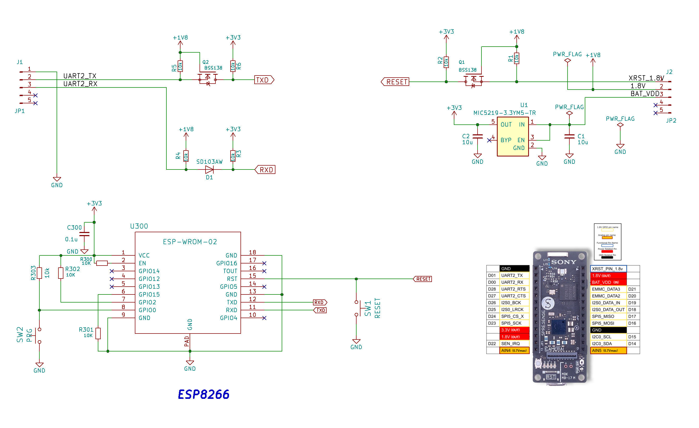
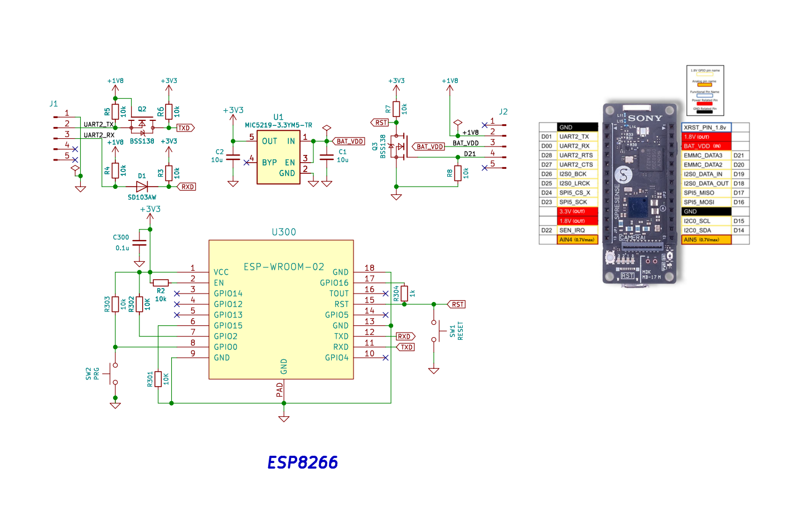

# SPRESENSE Wi-Fi Add-on

 [English](README_EN.md)

## 概要
Sonyの省電力で高性能なIoT開発ボードSPRESENSEにWi-FI機能を追加するためのアドオンボードです。
ESP8266(ESP-WROOM-02, 技適取得済)を搭載、SPRESENSEとEP8266の間の通信は [Espressif標準のATコマンド](ESP8266_AT_command/) を使用します。

## 主な仕様
- ESP8266(ESP-WROOM-02)を搭載
- SPRESENSEメインボード上面の拡張コネクタに直接装着可能（レベルシフタ搭載）
- ハーフサイズ設計で他のハーフサイズモジュールと同時に使用可能
- I2C・SPI接続のモジュールとの同時使用が可能（一部制限あり）
- 技適取得済み

### v2.2について(2026年1月リリース)
従来のバージョン(v1.1)と比較して、以下の変更があります：
- ESP8266 Deep sleep機能への対応

この対応のため、リセット回路の設計を変更しました。そのため、従来のv1.1のソフトウエアを使用する場合は、以下のリセットピン(D21)の制御の追加が必要となります。

```cpp
#define rst_pin PIN_D21   // ESP8266のリセットピン, Hでリセット

void setup() {
  // ESP8266のリセットピンの設定
  pinMode(rst_pin, OUTPUT);
  // ESP8266のリセットを解除する(リセットピンをLにする)
  digitalWrite(rst_pin, LOW);

```

## 製品画像 (基板の色は予告なく変更になる場合があります)

### v1.1

#### 基板表面



#### 基板裏面



#### SPRESENSEへ取り付けた状態 (SPRESENSEは付属しません)



### v2.2

#### 基板表面



#### 基板裏面



#### SPRESENSEへ取り付けた状態 (SPRESENSEは付属しません)



## 回路図

### v1.1回路図



### v2.2回路図



## サンプルコード

各バージョンのサンプルコードは、`example/`ディレクトリ以下に格納されています。
- v1.1: `example/v1.1/`
- v2.2: `example/v2.2/`

各サンプルコードは、SPRESENSEのArduino IDE環境で動作するように設計されています。
詳細な使用方法は各サンプルコードのコメントを参照してください。

## ライセンス

このプロジェクトはGNU General Public License v3.0ライセンスの下で提供されます。詳細は[LICENSE](LICENSE)ファイルを参照してください。

## 作者

- [tomorrow56](https://github.com/tomorrow56)
